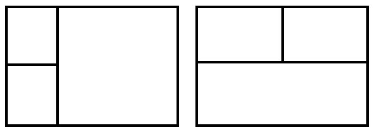

가로선 2개, 세로선 2개를 이용해 그림과 같이 직사각형을 9개의 영역으로 나눈다.

직사각형 내 값들의 합은 누적합을 이용해 미리 계산해놓는다.

다음의 경우와 같이 직사각형을 3개로 나눠 계산한다.

1. 123, 456, 789
1. 147, 258, 369
1. 1245, 36, 789
1. 1245, 369, 78
1. 2356, 14, 789
1. 2356, 147, 89
1. 4578, 12, 369
1. 4578, 123, 69
1. 5689, 23, 147
1. 5689, 123, 47
1. 123456, 7, 89
1. 123456, 78, 9
1. 456789, 1, 23
1. 456789, 12, 3
1. 124578, 3, 69
1. 124578, 36, 9
1. 235689, 1, 47
1. 235689, 14, 7

1, 2 번을 제외하곤 하나의 가로선과 하나의 세로선 만을 이용해서 구할 수 있다.

대충 아래 그림과 같다.



```java
import java.io.IOException;

public class Main {
	private static int height, width;
	private static int[][] a;

	private static int read() throws IOException {
		int n = System.in.read() & 15, c;

		while (48 <= (c = System.in.read()) && c <= 57)
			n = (n << 3) + (n << 1) + (c & 15);
		return n;
	}

	public static void main(String[] args) throws IOException {
		long res = 0, r1, r2, r3, r4;

		a = new int[(height = read()) + 1][(width = read()) + 1];
		for (int i = 1; i <= height; i++) {
			for (int j = 1; j <= width; j++)
				a[i][j] = (System.in.read() & 15) + a[i - 1][j] + a[i][j - 1] - a[i - 1][j - 1];
			System.in.read();
		}
		// 세로 선 두 개로 세 직사각형을 구하는 경우
		for (int v1 = 1; v1 < width - 1; v1++)
			for (int v2 = v1 + 1; v2 < width; v2++)
				res = Math.max(res,
						(long) a[height][v1] * (long) (a[height][v2] - a[height][v1]) * (a[height][width] - a[height][v2]));
		// 가로 선 두 개로 세 직사각형을 구하는 경우
		for (int h1 = 1; h1 < height - 1; h1++)
			for (int h2 = h1 + 1; h2 < height; h2++)
				res = Math.max(res,
						(long) a[h1][width] * (long) (a[h2][width] - a[h1][width]) * (a[height][width] - a[h2][width]));
		// 가로 선 한 개와 세로 선 한 개로 세 직사각형을 구하는 경우
		for (int h = 1; h < height; h++) {
			for (int v = 1; v < width; v++) {
				// 시계 방향 기준 네 영역을 1, 2, 3, 4라 할 때
				r1 = a[h][v];
				r2 = a[h][width] - r1;
				r4 = a[height][v] - r1;
				r3 = a[height][width] - r2 - r4 - r1;
				/// 1, 2를 합친 경우
				res = Math.max(res, (r1 + r2) * r3 * r4);
				/// 2, 3을 합친 경우
				res = Math.max(res, (r2 + r3) * r1 * r4);
				/// 3, 4를 합친 경우
				res = Math.max(res, (r3 + r4) * r1 * r2);
				/// 4, 1을 합친 경우
				res = Math.max(res, (r4 + r1) * r2 * r3);
			}
		}
		System.out.println(res);
	}
}
```
