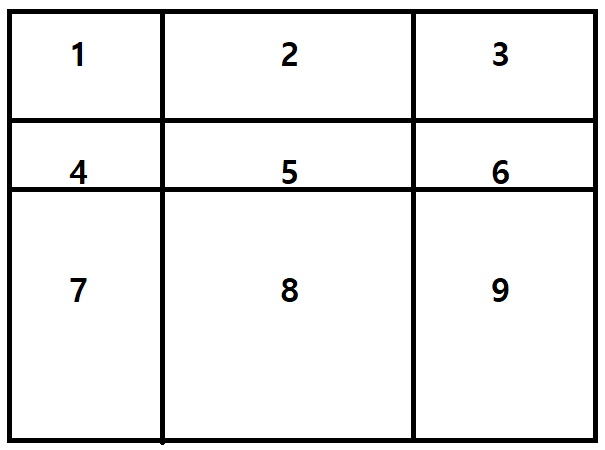

가로선 2개, 세로선 2개를 이용해 그림과 같이 직사각형을 9개의 영역으로 나눈다.

직사각형 내 값들의 합은 누적합을 이용해 미리 계산해놓는다.

다음의 경우와 같이 직사각형을 3개로 나눠 계산한다.

1. 123, 456, 789
1. 147, 258, 369
1. 1245, 36, 789
1. 1245, 369, 78
1. 2356, 14, 789
1. 2356, 147, 89
1. 4578, 12, 369
1. 4578, 123, 69
1. 5689, 23, 147
1. 5689, 123, 47
1. 123456, 7, 89
1. 123456, 78, 9
1. 456789, 1, 23
1. 456789, 12, 3
1. 124578, 3, 69
1. 124578, 36, 9
1. 235689, 1, 47
1. 235689, 14, 7
