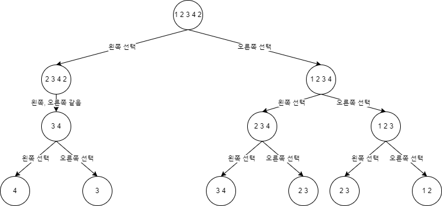

예제 1.

브루트포스로 위와 같이 앞, 뒤 중 하나를 골라 팰린드롬으로 만든다면 최대 2^5000개(앞, 뒤가 항상 다르게 구성된 숫자일 때)의 연산이 필요하므로, 무조건 시간 초과다.

다이나믹 프로그래밍 BOTTOM UP

DP 배열은 dp[시작 인덱스][끝 인덱스]로 현재 고려하는 부분 수열을 팰린드롬으로 만들 때 추가해야 하는 숫자의 개수를 저장한다.

> 예제 1과 다르게 마지막에 숫자가 남지 않을 수도 있다.

예를 들어 1 3 2 2 3이 입력으로 주어지면 1 3 2 2 3 1로 만드는 게 가장 적은 수를 추가하는 방법이므로 1 3 2 2 3 → 3 2 2 3 → 2 2 → 남은 숫자가 없음 과 같이 진행된다.

따라서 진행 과정에서 남은 숫자가 한 개거나 없다면 그 때 dp의 값을 0으로 설정하고 반환한다.

> 즉, 아직 처리되지 않은 dp의 값을 0이 아닌 다른 값을 활용해야 한다. => -1을 활용하자.
