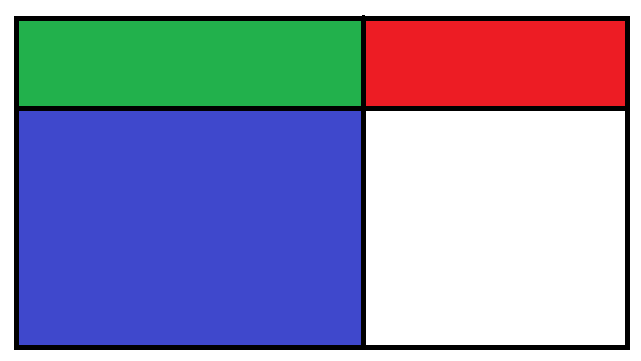

DP인 것 같다.

dp[i][j] = (0, 0)을 왼쪽 상단으로, (i, j)를 오른쪽 하단으로 하는 부분행렬 내 정수의 합

(x, y)를 왼쪽 상단으로, (i, j)를 오른쪽 하단으로 하는 부분 행렬 내 정수의 합은 아래와 같이 구할 수 있다.

dp[i][j] 에서 빨간 부분행렬 + 초록 부분행렬을 제거하고, 파란 부분행렬 + 초록 부분행렬을 제거한 후 초록 부분행렬을 더해주면 된다.



```java
import java.io.IOException;

public class Main {
	private static int height, width;
	private static int[][] dp;

	private static int read() throws IOException {
		int n = 0, c, s = System.in.read();

		if (s != 45)
			n = s & 15;
		while (48 <= (c = System.in.read()) && c <= 57)
			n = (n << 3) + (n << 1) + (c & 15);
		return s != 45 ? n : ~n + 1;
	}

	public static void main(String[] args) throws IOException {
		int res;

		dp = new int[(height = read()) + 1][(width = read()) + 1];
		// 행렬을 입력 받아 dp 구성: 행 우선으로 먼저 더하고, 윗 열의 값을 더한다.
		dp[1][1] = read();
		for (int j = 2; j <= width; j++)
			dp[1][j] = read() + dp[1][j - 1];
		for (int i = 2; i <= height; i++) {
			dp[i][1] = read();
			for (int j = 2; j <= width; j++)
				dp[i][j] = read() + dp[i][j - 1];
			for (int j = 1; j <= width; j++)
				dp[i][j] += dp[i - 1][j];
		}
		// 각 부분 행렬을 모두 체크
		res = dp[height][width];
		for (int is = 1; is <= height; is++)
			for (int js = 1; js <= width; js++)
				for (int ie = is; ie <= height; ie++)
					for (int je = js; je <= width; je++)
						res = Math.max(res, dp[ie][je] - dp[is - 1][je] - dp[ie][js - 1] + dp[is - 1][js - 1]);
		System.out.println(res);
	}
}
```

> 시간복잡도

ie가 height \* (height + 1) / 2, je가 width \* (width + 1) / 2회 반복이므로 최대 ${(200 * 201 / 2)}^2$ 회의 연산이 필요하다.

이는 대략 4억회의 연산이다.
