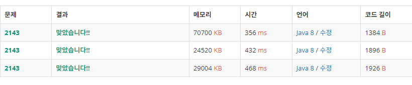

누적 합 + 정렬 + (이분 탐색 or 투 포인터)

입력받은 두 배열 각 원소의 값을 애초에 누적 합으로 저장 -> 배열 최대 원소 수가 1000이고, 절댓값이 1000000이므로, long 타입 배열을 써야 한다.
-> 1000짜리 long 배열 두 개를 저장하기 위한 메모리 = 0.0153 MB
이분 탐색은 upper bound와 lower bound를 각각 찾아서 둘의 차이를 구해 찾는 숫자가 배열 내에 몇 번 등장하는지 확인하는 방법이지만, 투 포인터보다 느리다.

투 포인터로 풀자.

두 배열의 최대 크기 1000을 기준으로, i부터 j까지의 합을 구하기 위해 필요한 연산의 수 : 1000 \* 1000 \* 2 = 200만
-> 100만짜리 long 배열 두 개를 저장하기 위한 메모리 = 대략 15.3 MB

100만짜리 두 배열 정렬에 필요한 연산의 수 : 100만 \* log(100만) \* 2 = 대략 4000만
두 배열 모두 오름 차순으로 정렬 후, 한 배열은 작은 값부터 포인터를 증가시키고, 나머지 배열은 큰 값부터 포인터를 감소시키며 두 포인터가 가리키는 값의 합과 t를 비교한다.

---

이분 탐색으로 풀면, 두 배열 중 하나는 크기 최대 1000짜리 누적 합 배열만 하나 만들고, 그 배열을 arr이라 하면 모든 arr[j] - arr[i - 1]를 통해 i부터 j까지의 합을 구할 수 있다.
이 값을 기준으로 t를 만들기 위한 나머지 값을 다른 배열에서 이분 탐색하면 된다.

따라서 모든 부 배열의 합을 구하는 연산도 두 배열 중 하나에서만 수행하면 되고, 정렬 또한 그렇다.
-> 필요한 연산의 수 : 대략 100만 + 2000만

java8 기준 이분 탐색이 더 빠르게 나왔다. 테스트케이스 구성이 이분 탐색에 유리하게 되어있는 것 같다.

---

해시 맵을 이용해 O(1)에 원하는 숫자의 개수를 파악할 수 있는 방법도 있다.

---

아래 결과는 아래부터 순서대로 투 포인터 방식, 이분 탐색 방식, 해시 맵 방식 코드의 제출 결과다.

