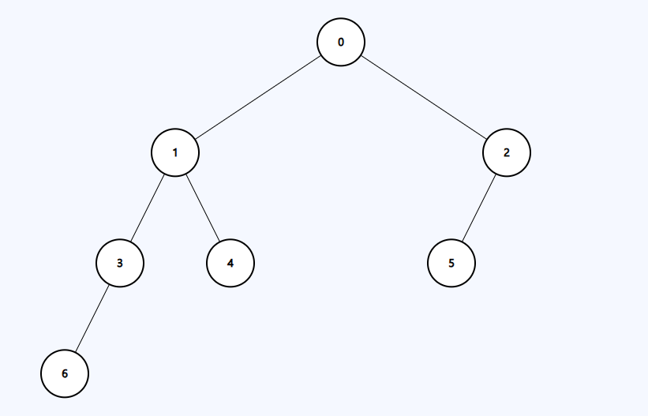
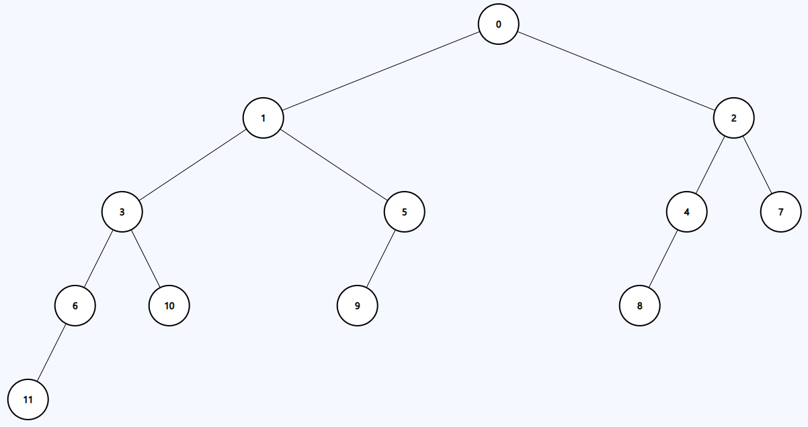
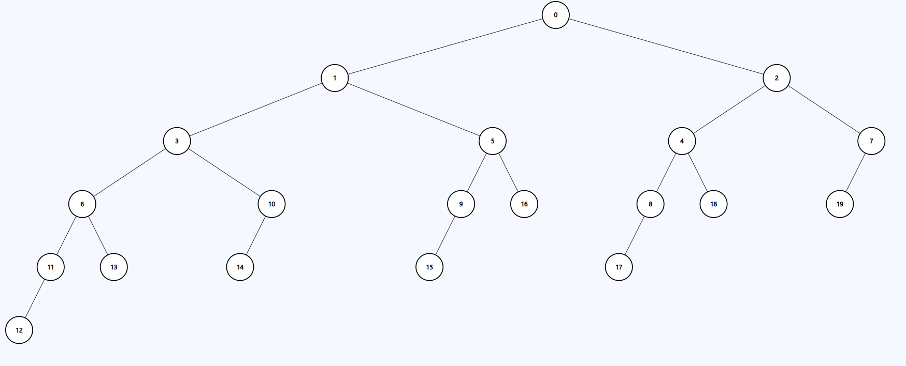

```
1
1 + 2
1 + 2 + 4
1 + 2 + 4 + 8
...
```

모든 비트가 다 차 있는 값(2의 거듭 제곱 - 1)이 들어오면 perfect binary tree를 구성하게 되고, 그 다음 값부터 다음 perfect binary tree 까지의 값은 같은 값을 갖는다.

---

1 → 1

2 → 2
3 → 2

4 → 3
5 → 3
6 → 3
7 → 3

8, 9, 10, 11, 12, 13, 14, 15 → 4

주어진 값에 $log_2$를 취한 값에서 정수부만 취해 1을 더하면 된다.

> 아니다. 이렇게 하면 예제에서 1,000,000,000이 입력으로 들어온 경우 42가 출력되지 않는다.

> 또한 7일 때도 4를 출력하는 게 맞다.

1 → 1

2 → 2
3 → 2

4 → 3
5 → 3
6 → 3

7, 8, 9, 10, 11 → 4



12, 13, 14, 15, 16, 17, 18, 19 → 5



20 → 6



```
1    2    3    4    5
1    2    3    5    8
```

피보나치..?

위와 같은 피보나치를 구한 후 누적합을 구하고 이분 탐색을 활용한다.

예를 들어 노드의 개수가 6개라면 최대 높이는 3인데 인덱스가 3(1-base)일 때 누적합의 값이 6이므로 lower bound를 써야 한다.
