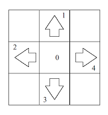

**브루트포스**

매 번 왼쪽과 오른쪽을 선택한 분기가 발생하므로 $O(2^N)$ -> 시간 초과

**그리디**

다음 칸에 대해, 왼발과 오른발 중 힘이 덜 드는 발을 옮기기

> 두 발을 옮기는 데에 드는 힘이 같다면?

선택 기준이 없다.  
아무 발이나 선택하면 안되는 게, 왼발은 1, 오른발은 3에 있다고 해보자.  
다음으로 옮길 칸이 4여서 왼발과 오른발을 옮기는 데에 드는 힘은 같은 상황이다.  
왼발을 선택해서 옮긴다 할 때, 다음 누를 칸이 1이고, 이 칸이 마지막이라면 왼발이 아닌 오른발을 옮겼어야 한다.
(예제: 1 3 4 1 0)

-> 다음에 옮겨야 할 서로 다른 두 칸(연속한 번호의 칸은 하나로 침) 번호를 확인하고 다음과 같이 결정

1. 둘 다 현재 발이 위치한 칸과 다르다 -> 아무 발이나 힘이 덜 드는 발을 옮기기
2. 둘 다 현재 발이 위치한 칸과 같다 -> 안옮기기 -> 결국 힘이 덜 드는 발을 옮기는 것과 같다.
3. 둘 중 하나는 현재 발이 위치한 칸이고 하나는 다른 칸이다
   1. 두 발이 인접한 칸(1-2, 2-3, 3-4, 4-1)일 때, 다음으로 이동할 서로 다른 두 칸이 두 발이 위치한 칸들 중 하나와 그 반대편 칸이라면
      나머지 발을 옮기기 -> 이 때도 결국 힘이 덜 드는 발을 옮기게 된다.
   2. 두 발이 인접한 칸일 때, 다음으로 이동할 서로 다른 두 칸이 두 발이 위치한 칸을 제외한 나머지 두 칸일 때 -> 힘이 덜 드는 발을 옮긴다?
      -> 그 다음으로 옮길 칸이 다시 기존에 발이 위치했던 칸과 그렇지 않은 칸이라면 기존에 발이 위치했던 칸의 발은 옮기지 않는 것이 좋다.
      -> 여기서 결국 또 다음 두 칸을 더 확인해야 하네.. 그리디는 아닌 것 같다.  
      ...이하 생략...

옮기는 힘이 같을 땐 둘 다 옮기고, 확실히 적은 힘이 드는 발이 있을 땐 그 발을 옮기기?

> 입력이 1 4 2 1 0이면?

(0,0) -> (0,1) -> (4,1).  
여기서 1칸에 있는 오른발을 2로 옮기기로 하면 남은 칸을 이동하는데 드는 힘은 6이다.  
반대로 4칸에 있는 왼발을 2로 옮기면 이동하는데 드는 힘은 4 + 1로 5다.

즉, 무조건 현재 비용이 덜 드는 발을 고르는 게 답이 아니다.

> 시작할 땐 어떤 발을 옮기든 상관없나?

어차피 중앙에서 옮기는 게 힘이 가장 적게 들기 때문에 왼발을 먼저 옮기든 오른발을 먼저 옮기든 다음에 나오는 칸이 이미 밟고 있는 칸이 아니라면 무조건 중앙에 남아있는 발을 옮기게 된다. 따라서 특정 시점에 왼발, 오른발의 위치가 서로 바뀔 순 있지만 결과에 영향을 미치진 않는다.

**dp**

현재 칸에 대해 왼발, 오른발을 이동시켰을 때 드는 힘 + 이전 칸의 왼발, 오른발 이동 시 드는 힘을 더했을 때 둘 중 작은 값 과 왼발, 오른발 위치를 저장

- 1 2 2 4 0

(왼)0 (2, 1, 0) (4, 2, 1) (5, 2, 1) (5, 2, 4)  
(오)1 (2, 0, 1) (4, 1, 2) (5, 1, 2) (5, 4, 2)

- 1 3 4 1 0

(왼)0 (2, 1, 0) (4, 3, 1) ((7, 1, 4), (7, 3, 4)) (8, 1, 4)
(오)1 (2, 0, 1) (4, 1, 3) ((7, 4, 1), (7, 4, 3)) (8, 4, 1)

- 1 4 2 1 0

왼 (2, 1, 0) (4, 4, 1) (7, 2, 4) -> 땡
오 (2, 0, 1) (4, 1, 4) (7, 4, 2) -> 땡

이 방식으로는 무조건 왼발, 오른발을 이동하는 경우를 다 연산해야 한다 결국엔.

---

`x - 1`번째 까지의 구성이 다르다 하더라도 `x`번째의 왼발, 오른발 위치가 같다면 그 뒤로 중복이 발생한다. 이를 제거해야 한다.

뒷 부분의 구성에 대한 최소 힘을 먼저 구한다 => `BOTTOM UP`
