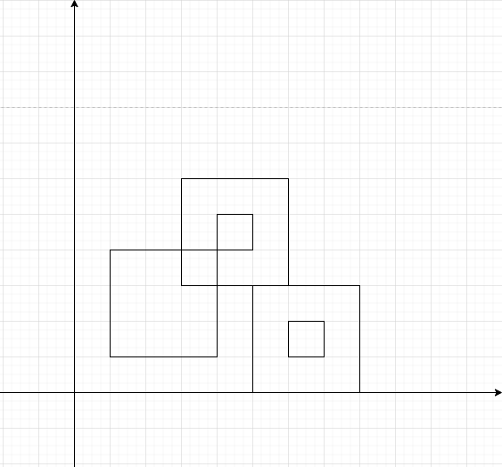
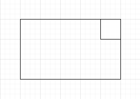
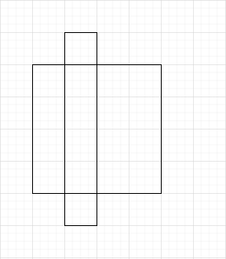

> 예제 입력 3



> 분리 집합

- 직사각형끼리 만난다면 union.
- 최종 분리 집합의 개수 - 1을 출력

> 시간 복잡도

직사각형이 최대 1,000개니까 총 4,000개의 변이 존재하고, 4,000개의 변이 서로 맞닿는지 확인하는데 16,000,000 개의 연산이 필요하다.

그 중 서로 교차하는 두 변을 가진 사각형을 union 하면 된다.

시간 내에 통과할 수 있다.

> 두 사각형이 만나는 걸 효율적으로 판단하는 방법?

한 사각형의 변을 포함한 영역 내에 다른 사각형의 꼭지점이 위치한다면 두 사각형은 만난다.

사각형 A의 좌표 정보 ax1, ay1, ax2, ay2와 사각형 B의 좌표 정보 bx1, by1, bx2, by2가 있을 때를 기준으로 방법을 적어보자.

사각형 B의 꼭짓점은 다음과 같다.

1. (bx1, by1)
1. (bx1, by2)
1. (bx2, by1)
1. (bx2, by2)

이 네 개의 꼭짓점 중 하나인 (bx, by)가 다음에 범위에 포함되면서 (bx, by)를 한 끝으로 하는 두 변의 나머지 끝이 포함되지 않는다면 두 사각형은 만난다. (나머지 두 끝이 모두 포함되면 만나는 게 아니라 A가 B 내부에 위치한 것)

ax1 <= bx <= ax2 && ay1 <= by <= ay2 && (bx, by)와 변으로 연결된 두 꼭짓점 중 하나라도 이 영역에 포함되지 않아야 함

> 시작 지점은 x1, y1, x2, y2가 0, 0, 0, 0인 가상의 점 사각형으로 간주해도 로직에 문제가 없다.

> 3% 부근에서 틀린 코드

```java
import java.io.IOException;

public class Main {
	private static int setCount;
	private static int[] ds;

	private static int read() throws IOException {
		int n = 0, c, s = System.in.read();

		if (s != 45)
			n = s & 15;
		while (48 <= (c = System.in.read()) && c <= 57)
			n = (n << 3) + (n << 1) + (c & 15);
		return s == 45 ? ~n + 1 : n;
	}

	private static boolean isAdjacent(int[] r1, int[] r2) {
		int ax1 = r1[0], ay1 = r1[1], ax2 = r1[2], ay2 = r1[3], bx1 = r2[0], by1 = r2[1], bx2 = r2[2], by2 = r2[3];

		return (ax1 <= bx1 && bx1 <= ax2 && ay1 <= by1 && by1 <= ay2 && ((bx1 < ax1 || ax2 < bx1 || by2 < ay1 || ay2 < by2) || (bx2 < ax1 || ax2 < bx2 || by1 < ay1 || ay2 < by1)))
				|| (ax1 <= bx1 && bx1 <= ax2 && ay1 <= by2 && by2 <= ay2 && ((bx1 < ax1 || ax2 < bx1 || by1 < ay1 || ay2 < by1) || (bx2 < ax1 || ax2 < bx2 || by2 < ay1 || ay2 < by2)))
				|| (ax1 <= bx2 && bx2 <= ax2 && ay1 <= by1 && by1 <= ay2 && ((bx1 < ax1 || ax2 < bx1 || by1 < ay1 || ay2 < by1) || (bx2 < ax1 || ax2 < bx2 || by2 < ay1 || ay2 < by2)))
				|| (ax1 <= bx2 && bx2 <= ax2 && ay1 <= by2 && by2 <= ay2 && ((bx1 < ax1 || ax2 < bx1 || by2 < ay1 || ay2 < by2) || (bx2 < ax1 || ax2 < bx2 || by1 < ay1 || ay2 < by1)));
	}

	private static int find(int node) {
		int root = node, upper;

		while (ds[root] >= 0)
			root = ds[root];
		while (ds[node] >= 0) {
			upper = ds[node];
			ds[node] = root;
			node = upper;
		}
		return root;
	}

	private static void union(int u, int v) {
		int uRoot = find(u), vRoot = find(v);

		if (uRoot == vRoot)
			return;
		if (uRoot < vRoot) {
			ds[uRoot] += ds[vRoot];
			ds[vRoot] = uRoot;
		} else {
			ds[vRoot] += ds[uRoot];
			ds[uRoot] = vRoot;
		}
		setCount--;
	}

	public static void main(String[] args) throws IOException {
		// 시작 지점을 고려해야 하므로 1을 더한다.
		int n = read() + 1;
		int[][] rects = new int[n][];

		ds = new int[n];
		rects[0] = new int[] { 0, 0, 0, 0 };
		ds[0] = -1;
		for (int i = 1; i < n; i++) {
			rects[i] = new int[] { read(), read(), read(), read() };
			ds[i] = -1;
		}
		setCount = n;
		for (int i = 0; i < n; i++)
			for (int j = i + 1; j < n; j++)
				if (isAdjacent(rects[i], rects[j]))
					union(i, j);
		System.out.println(setCount - 1);
	}
}
```

> 위의 isAdjacent 로직은 다음과 같은 경우에 맞닿지 않는 것으로 판단한다.



따라서 isAdjacent의 로직을 다음과 같이 바꿔야 한다.

```java
	private static boolean isAdjacent(int[] r1, int[] r2) {
		int ax1 = r1[0], ay1 = r1[1], ax2 = r1[2], ay2 = r1[3], bx1 = r2[0], by1 = r2[1], bx2 = r2[2], by2 = r2[3];

		return (ax1 <= bx1 && bx1 <= ax2 && ay1 <= by1 && by1 <= ay2 && ((bx1 <= ax1 || ax2 <= bx1 || by2 <= ay1 || ay2 <= by2) || (bx2 <= ax1 || ax2 <= bx2 || by1 <= ay1 || ay2 <= by1)))
				|| (ax1 <= bx1 && bx1 <= ax2 && ay1 <= by2 && by2 <= ay2 && ((bx1 <= ax1 || ax2 <= bx1 || by1 <= ay1 || ay2 <= by1) || (bx2 <= ax1 || ax2 <= bx2 || by2 <= ay1 || ay2 <= by2)))
				|| (ax1 <= bx2 && bx2 <= ax2 && ay1 <= by1 && by1 <= ay2 && ((bx1 <= ax1 || ax2 <= bx1 || by1 <= ay1 || ay2 <= by1) || (bx2 <= ax1 || ax2 <= bx2 || by2 <= ay1 || ay2 <= by2)))
				|| (ax1 <= bx2 && bx2 <= ax2 && ay1 <= by2 && by2 <= ay2 && ((bx1 <= ax1 || ax2 <= bx1 || by2 <= ay1 || ay2 <= by2) || (bx2 <= ax1 || ax2 <= bx2 || by1 <= ay1 || ay2 <= by1)));
	}
```

또한 불필요한 부분이 있는데, 리턴 문 내에서 OR로 연결된 가장 큰 네 개의 부분 중 첫 번째 부분만 보자.

```java
(
	ax1 <= bx1 && bx1 <= ax2 && ay1 <= by1 && by1 <= ay2 &&
	(
		// 여기서부터 (bx1, by1)은 무조건 사각형 A 내부에 존재하는 점이다.
		// 즉, bx1과 by1의 범위는 고정되어있고, 각 변의 나머지 끝인 (bx1, by2)와 (bx2, by1)에 대해
		// by2와 bx2의 범위만 각각 고려해주면 된다.
		// bx1 <= ax1 || ax2 <= bx1은 확인할 필요가 없다.
		(bx1 <= ax1 || ax2 <= bx1 || by2 <= ay1 || ay2 <= by2) ||
		// by1 <= ay1 || ay2 <= by1는 확인할 필요가 없다.
		(bx2 <= ax1 || ax2 <= bx2 || by1 <= ay1 || ay2 <= by1)
	)
)
```

따라서 아래와 같이 코드를 줄일 수 있다.

```java
(
	ax1 <= bx1 && bx1 <= ax2 && ay1 <= by1 && by1 <= ay2 &&
	(
		(by2 <= ay1 || ay2 <= by2) || (bx2 <= ax1 || ax2 <= bx2)
	)
)
```

> 틀림

아래 코드는 B의 꼭지점 네 개가 모두 A의 바깥에 존재하지만 겹치는 경우를 고려하지 못한다.

```java
import java.io.IOException;

public class Main {
	private static int setCount;
	private static int[] ds;

	private static int read() throws IOException {
		int n = 0, c, s = System.in.read();

		if (s != 45)
			n = s & 15;
		while (48 <= (c = System.in.read()) && c <= 57)
			n = (n << 3) + (n << 1) + (c & 15);
		return s == 45 ? ~n + 1 : n;
	}

	private static boolean isAdjacent(int[] r1, int[] r2) {
		int ax1 = r1[0], ay1 = r1[1], ax2 = r1[2], ay2 = r1[3], bx1 = r2[0], by1 = r2[1], bx2 = r2[2], by2 = r2[3];

		return (ax1 <= bx1 && bx1 <= ax2 && ay1 <= by1 && by1 <= ay2
				&& (by2 <= ay1 || ay2 <= by2 || bx2 <= ax1 || ax2 <= bx2))
				|| (ax1 <= bx1 && bx1 <= ax2 && ay1 <= by2 && by2 <= ay2
						&& (by1 <= ay1 || ay2 <= by1 || bx2 <= ax1 || ax2 <= bx2))
				|| (ax1 <= bx2 && bx2 <= ax2 && ay1 <= by1 && by1 <= ay2
						&& (bx1 <= ax1 || ax2 <= bx1 || by2 <= ay1 || ay2 <= by2))
				|| (ax1 <= bx2 && bx2 <= ax2 && ay1 <= by2 && by2 <= ay2
						&& (bx1 <= ax1 || ax2 <= bx1 || by1 <= ay1 || ay2 <= by1));
	}

	private static int find(int node) {
		int root = node, upper;

		while (ds[root] >= 0)
			root = ds[root];
		while (ds[node] >= 0) {
			upper = ds[node];
			ds[node] = root;
			node = upper;
		}
		return root;
	}

	private static void union(int u, int v) {
		int uRoot = find(u), vRoot = find(v);

		if (uRoot == vRoot)
			return;
		if (uRoot < vRoot) {
			ds[uRoot] += ds[vRoot];
			ds[vRoot] = uRoot;
		} else {
			ds[vRoot] += ds[uRoot];
			ds[uRoot] = vRoot;
		}
		setCount--;
	}

	public static void main(String[] args) throws IOException {
		// 시작 지점을 고려해야 하므로 1을 더한다.
		int n = read() + 1;
		int[][] rects = new int[n][];

		ds = new int[n];
		rects[0] = new int[] { 0, 0, 0, 0 };
		ds[0] = -1;
		for (int i = 1; i < n; i++) {
			rects[i] = new int[] { read(), read(), read(), read() };
			ds[i] = -1;
		}
		setCount = n;
		for (int i = 0; i < n; i++)
			for (int j = i + 1; j < n; j++)
				if (isAdjacent(rects[i], rects[j]))
					union(i, j);
		System.out.println(setCount - 1);
	}
}
```



> 교차하는 경우를 하나씩 고려하기엔 코드가 난잡해질 것 같다.

교차하지 않는 경우를 고려해보자. 문제의 조건에 따라 아래가 성립한다.

```
ax1 < ax2
ay1 < ay2
bx1 < bx2
by1 < by2
```

교차하지 않는 조건

- 두 사각형이 서로를 포함하지 않으면서 교차하지 않는 조건

1. bx2 < ax1
1. bx1 > ax2
1. by1 > ay2
1. by2 < ay1

- 한 사각형이 나머지 사각형을 포함하면서 교차하지 않는 조건

입력으로 주어진 두 대각 꼭짓점이 다른 사각형 영역 내부에 포함되는지 확인하면 된다.

1. ax1 < bx1 && bx1 < ax2 && ay1 < by1 && by1 < ay2 && ax1 < bx2 && bx2 < ax2 && ay1 < by2 && by2 < ay2
2. bx1 < ax1 && ax1 < bx2 && by1 < ay1 && ay1 < by2 && bx1 < ax2 && ax2 < bx2 && by1 < ay2 && ay2 < by2

따라서, bx2 < ax1 || bx1 > ax2 || by1 > ay2 || by2 < ay1 || (ax1 < bx1 && bx1 < ax2 && ay1 < by1 && by1 < ay2 && ax1 < bx2 && bx2 < ax2 && ay1 < by2 && by2 < ay2) || (bx1 < ax1 && ax1 < bx2 && by1 < ay1 && ay1 < by2 && bx1 < ax2 && ax2 < bx2 && by1 < ay2 && ay2 < by2)가 성립하면 교차하지 않는다.
